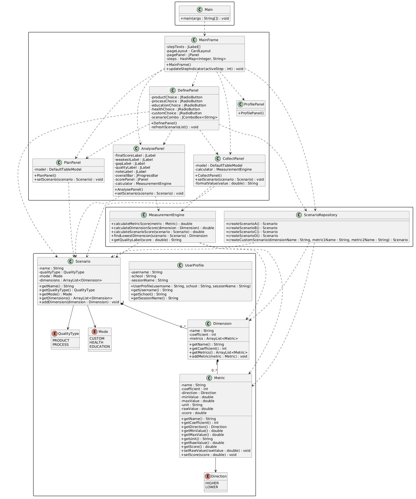

# PROJECT REQUIREMENTS AND DESIGN

## PROJECT REQUIREMENTS

## Functional Requirements

* The system shall allow the user to enter profile information including username, school, and session name.

* The system shall allow the user to select quality type, mode, and scenario.

* The system shall display predefined dimensions and metrics in a structured table.

* The system shall calculate metric scores between 1 and 5 according to measurement ranges and direction rules.

* The system shall round scores to the nearest 0.5 step.

* The system shall calculate weighted dimension scores using predefined coefficients.

* The system shall calculate an overall scenario score.

* The system shall perform gap analysis and identify the lowest scoring dimension.

* The system shall display a step indicator showing active and completed process steps.

* The system shall display results using progress bars and quality labels.

* The system shall provide Back and Next navigation between steps.

* The system supports a custom scenario as a bonus feature.

## Non-Functional Requirements

* The system shall provide a user-friendly graphical interface.

* The system shall validate user inputs before moving between steps.

* The system shall be implemented using Java Swing.

* The system shall use separate model, service, and GUI classes.

* The system shall follow modular and maintainable design principles.

* The system shall run without external libraries.

* The system shall perform calculations without noticeable delay.

# PROJECT DESIGN

## Architecture

The project follows a layered structure using separate model, service, and GUI classes.

* Model stores metrics, dimensions, scenarios, and user data.

* Service performs calculations and manages predefined scenarios.

* GUI contains the step panels and user interface components.

This separation improves maintainability and readability.

## Design Approach

* CardLayout is used for step-by-step navigation.

* Each measurement step is implemented as a separate JPanel.

* User interaction follows a sequential wizard-based workflow.

## Design Patterns

### Wizard Pattern

CardLayout is used to implement step-by-step wizard navigation.

Profile → Define → Plan → Collect → Analyse

## Data Design

The system uses a hierarchical measurement structure.

* A Scenario contains multiple Dimensions.

* A Dimension contains multiple Metrics.

* Each Metric stores measurement values and calculated scores.

## Data Structures

* ArrayList is used to store dimensions and metrics.

* HashMap is used to manage step indicator information.

* Scenario objects store measurement data.

## Class Design

* MainFrame controls navigation and the step indicator.

* ProfilePanel handles user profile input.

* DefinePanel handles scenario selection.

* PlanPanel displays dimensions and metrics.

* CollectPanel calculates and displays metric scores.

* AnalysePanel displays final results and gap analysis.

* MeasurementEngine performs calculations.

* ScenarioRepository manages predefined scenarios.

### UML Class Diagram

## Calculation Design

MeasurementEngine performs:

* score normalization

* weighted dimension score calculation

* final scenario score calculation

* gap analysis

* quality level evaluation

Calculation flow:

1. Raw values are evaluated against metric ranges.

2. Metric scores are normalized to a 1–5 scale.

3. Scores are rounded to the nearest 0.5.

4. Weighted dimension scores are calculated.

5. Final scenario score is generated.

6. Gap analysis identifies the weakest dimension.

## Scenario Management

ScenarioRepository manages:

* Education scenarios

* Health scenarios

* Custom scenario (bonus)
